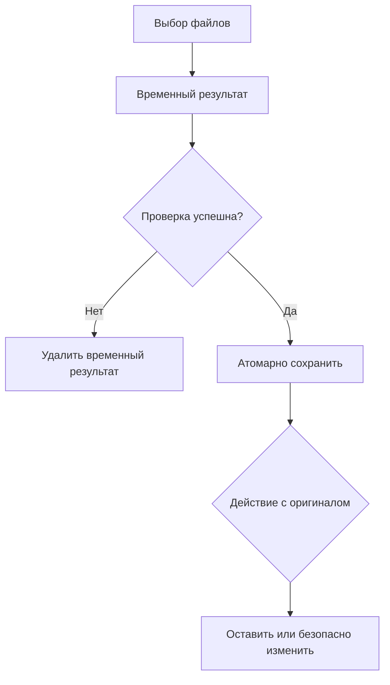

<div align="center">
  

  # SleepArchive

  **Настрой один раз — SleepArchive сам поддерживает порядок в файлах.**

  Современное Windows-приложение для безопасной автоматической архивации старых файлов и распаковки новых архивов.

  [](https://github.com/SleepKidd/SleepArchive/actions/workflows/ci.yml)
  
  
  
  [](LICENSE)

  **Создатель: [Sleepkidd Studio](https://github.com/SleepKidd)**  
  Telegram: [@sleepkidd](https://t.me/sleepkidd)
</div>

---

## Содержание

- [Что умеет SleepArchive](#что-умеет-sleeparchive)
- [Быстрый старт](#быстрый-старт)
- [Как пользоваться AutoArchive](#как-пользоваться-autoarchive)
- [Как пользоваться AutoExtract](#как-пользоваться-autoextract)
- [Интерфейс](#интерфейс)
- [Как защищены файлы](#как-защищены-файлы)
- [Настройки и данные](#настройки-и-данные)
- [Структура проекта](#структура-проекта)
- [Запуск из исходников](#запуск-из-исходников)
- [Сборка EXE](#сборка-exe)
- [Тестирование](#тестирование)
- [Решение проблем](#решение-проблем)
- [Ограничения](#ограничения)
- [Автор и обратная связь](#автор-и-обратная-связь)

## Что умеет SleepArchive

SleepArchive объединяет два инструмента в одной программе.

### AutoArchive

- создаёт несколько независимых правил архивации;
- выбирает файлы по возрасту: например, старше 30 дней;
- поддерживает подпапки и маски исключений;
- создаёт ZIP или 7Z с выбранным уровнем сжатия;
- группирует архивы по месяцам, годам или складывает всё в один архив;
- запускается вручную, при старте приложения, ежедневно или еженедельно;
- показывает предпросмотр до ручного запуска;
- после успешной проверки может оставить, переместить или удалить оригиналы;
- автоматически исключает папку назначения и не архивирует собственный результат.

Пример результата:

```text
Archive/
├── 2026-07.zip
├── 2026-08.zip
└── 2026-09.zip
```

### AutoExtract

- наблюдает сразу за несколькими папками;
- распаковывает ZIP, 7Z, TAR, TAR.GZ и TGZ;
- ждёт завершения загрузки или копирования архива;
- подавляет повторные файловые события через debounce;
- не обрабатывает один и тот же архив параллельно;
- распаковывает рядом с архивом или в выбранную папку;
- никогда не перезаписывает существующую пользовательскую папку;
- после проверки может оставить, переместить или удалить исходный архив.

```text
Downloads/
├── program.zip
└── program/
    ├── file1.txt
    └── file2.txt
```

Если `program/` уже существует, будет создана папка `program (2)/`.

## Быстрый старт

### Готовая EXE-сборка

1. Откройте раздел [Releases](https://github.com/SleepKidd/SleepArchive/releases).
2. Скачайте `SleepArchive.exe`, когда готовая сборка опубликована.
3. Запустите приложение.
4. Пройдите короткое приветствие.
5. Создайте первое правило AutoArchive или AutoExtract.

> [!NOTE]
> Если готового релиза пока нет, соберите приложение из исходников командой `build.bat` по инструкции ниже.

## Как пользоваться AutoArchive

1. Откройте **AutoArchive** в боковом меню.
2. Нажмите **Создать правило**.
3. Укажите понятное название, например `Документы`.
4. Выберите исходную папку.
5. Укажите возраст файлов, например `30 дней`.
6. Выберите папку назначения для архивов.
7. При необходимости раскройте дополнительные настройки:
   - ZIP или 7Z;
   - уровень сжатия;
   - группировка по месяцам, годам или в один архив;
   - маски исключений (`*.tmp; cache/*; ~*`);
   - расписание;
   - действие с оригиналами.
8. Нажмите **Сохранить**.
9. Используйте **Запустить** для ручной проверки правила.
10. Проверьте предпросмотр и подтвердите операцию.

### Действия с оригиналами

| Режим | Поведение |
|---|---|
| Оставить | Оригинальные файлы остаются на месте. Это режим по умолчанию. |
| Переместить | Файлы переносятся в указанную папку после проверки архива. |
| Удалить | Файлы удаляются только после создания и полной проверки архива. |

> [!WARNING]
> Используйте удаление только для правил, которые вы предварительно проверили. При любой ошибке архивирования оригиналы не удаляются.

## Как пользоваться AutoExtract

1. Откройте **AutoExtract**.
2. Нажмите **Создать правило**.
3. Укажите название правила.
4. Выберите папку наблюдения, например `Downloads`.
5. Выберите место распаковки:
   - рядом с архивом;
   - в отдельную выбранную папку.
6. Настройте действие после распаковки:
   - оставить архив;
   - переместить его в `Archives`;
   - удалить после проверки.
7. Укажите задержку проверки стабильности файла. По умолчанию — 3 секунды.
8. Сохраните и включите правило.

SleepArchive начнёт обработку только тогда, когда размер и время изменения файла перестанут меняться. Это защищает от попытки распаковать недокачанный архив.

## Интерфейс

| Раздел | Назначение |
|---|---|
| Главная | Состояние автоматизации, статистика, последние операции и быстрые действия. |
| AutoArchive | Создание, редактирование, запуск, дублирование и отключение правил архивации. |
| AutoExtract | То же для правил автоматической распаковки. |
| История | Поиск и фильтры по архивированию, распаковке, предупреждениям и ошибкам. |
| Настройки | Тема, автозапуск, tray, уведомления, подтверждения и частота проверок. |

Доступны светлая, тёмная и системная темы. При минимальной ширине окна карточки автоматически перестраиваются. Долгие операции выполняются в фоновых потоках и показывают текущий файл, объём, прогресс и кнопку безопасной отмены.

### Работа в фоне

При стандартных настройках кнопка закрытия сворачивает SleepArchive в system tray. Из меню tray можно:

- открыть приложение;
- запустить проверку;
- поставить автоматизацию на паузу;
- открыть настройки;
- полностью завершить процесс.

## Как защищены файлы

Сохранность данных имеет приоритет над скоростью и визуальными эффектами.



Основные защитные механизмы:

- временные имена `.sleeparchive_tmp` и атомарная фиксация результата;
- проверка CRC и точного списка файлов в созданном ZIP;
- проверка 7Z перед действиями с оригиналами;
- повторная проверка размера и времени изменения исходных файлов;
- запрет автоматической перезаписи существующих файлов и папок;
- автоматическое добавление `(2)`, `(3)` и далее при конфликте;
- защита ZIP/7Z/TAR от `../`, `..\`, абсолютных и дисковых путей;
- запрет символических ссылок в ZIP/7Z;
- запрет ссылок, устройств и FIFO в TAR;
- проверка доступного места до записи;
- защита от слишком большого количества элементов и подозрительной степени сжатия;
- исключение целевой папки AutoArchive из повторного обхода;
- очередь, debounce и набор уже обрабатываемых файлов для AutoExtract;
- обнаружение незавершённых временных операций после сбоя;
- оригиналы никогда не удаляются при ошибке создания или проверки результата.

## Настройки и данные

Пользовательские данные хранятся локально:

```text
%APPDATA%\SleepArchive\
├── config.json
├── history.json
└── logs\
    ├── sleeparchive.log
    ├── sleeparchive.log.1
    └── ...
```

Пример конфигурации:

```json
{
  "config_version": 1,
  "theme": "system",
  "start_with_windows": false,
  "minimize_to_tray": true,
  "archive_rules": [],
  "extract_rules": []
}
```

Запись настроек выполняется атомарно. Если JSON повреждён, SleepArchive сохраняет резервную копию `config.corrupt-*.json` и запускается с безопасными значениями по умолчанию.

Технические логи автоматически ротируются. Пользователь видит понятное сообщение, а подробности остаются в журнале.

## Структура проекта

```text
SleepArchive/
├── app.py                       # точка входа
├── core/                        # бизнес-логика без UI
│   ├── archive_engine.py        # поиск, создание и проверка ZIP/7Z
│   ├── extract_engine.py        # безопасная распаковка архивов
│   ├── file_watcher.py          # watchdog, очередь и debounce
│   ├── scheduler.py             # запуск по расписанию
│   ├── rule_manager.py          # CRUD и сохранение правил
│   ├── recovery.py              # поиск незавершённых операций
│   ├── safety.py                # проверки путей, места и конфликтов
│   └── models.py                # dataclasses и enums
├── services/
│   ├── config_service.py        # версионированный JSON-конфиг
│   ├── history_service.py       # история операций
│   ├── logging_service.py       # ротируемые технические логи
│   ├── notification_service.py  # уведомления без спама
│   ├── startup_service.py       # автозапуск Windows
│   └── tray_service.py          # меню system tray
├── ui/
│   ├── dialogs/                 # правила, preview и onboarding
│   ├── pages/                   # пять основных разделов
│   ├── widgets/                 # карточки, empty state и прогресс
│   ├── main_window.py           # координация UI и фоновых задач
│   ├── sidebar.py               # навигация
│   ├── styles.py                # светлая и тёмная QSS-темы
│   └── workers.py               # QRunnable / QThreadPool
├── assets/
│   ├── SleepArchive.ico         # иконка окна, tray и EXE
│   ├── logo.svg                 # логотип проекта
│   └── generate_icon.py         # воспроизводимая генерация ICO
├── tests/                        # unit, security, automation и UI smoke
├── .github/workflows/ci.yml     # автоматические проверки GitHub Actions
├── requirements.txt
├── SleepArchive.spec            # PyInstaller onefile без консоли
├── version_info.txt             # Windows metadata
├── build.bat                    # полный Windows build pipeline
├── pyproject.toml
├── LICENSE
└── README.md
```

### Разделение ответственности

| Слой | Что делает | Чего не делает |
|---|---|---|
| `core` | Выбирает, архивирует, распаковывает и проверяет файлы. | Не знает о Qt-виджетах. |
| `services` | Хранит конфиг/историю, управляет логами, tray и автозапуском. | Не содержит алгоритмов архивации. |
| `ui` | Показывает состояние и запускает фоновые задачи. | Не выполняет тяжёлые файловые операции в UI-потоке. |
| `tests` | Проверяет нормальные, ошибочные и атакующие сценарии. | Не использует реальные пользовательские данные. |

## Запуск из исходников

Требования:

- Windows 10/11;
- Python 3.12 или новее;
- Git — только если проект клонируется из репозитория.

```bat
git clone https://github.com/SleepKidd/SleepArchive.git
cd SleepArchive

py -3 -m venv .venv
.venv\Scripts\activate
python -m pip install --upgrade pip
python -m pip install -r requirements.txt
python assets\generate_icon.py
python app.py
```

Запуск свёрнутым:

```bat
python app.py --minimized
```

Расширенное логирование:

```bat
python app.py --debug
```

## Сборка EXE

На Windows откройте `cmd.exe` в корне репозитория и выполните:

```bat
build.bat
```

Если предыдущая попытка оставила повреждённое виртуальное окружение, выполните полностью чистую сборку:

```bat
build.bat --clean
```

Сценарий автоматически:

1. проверит Python 3.12+;
2. создаст `.venv`, если её нет;
3. обновит `pip`, `setuptools` и `wheel`;
4. установит зависимости;
5. сгенерирует ICO;
6. проверит исходники через Ruff;
7. запустит тесты и остановится при ошибке;
8. очистит старые `build/` и `dist/`;
9. соберёт onefile-приложение без консольного окна и проверит результат.

Готовый файл:

```text
dist\SleepArchive.exe
```

Первый запуск onefile-сборки может быть немного дольше: Qt распаковывается во временную системную папку. Для публичного распространения рекомендуется подписать EXE сертификатом Authenticode.

## Тестирование

```bat
python -m pytest
```

Покрыты, среди прочего:

- обычная ZIP/7Z-архивация;
- пустые и отсутствующие папки;
- вложенные папки и исключения;
- конфликты имён;
- отмена операции;
- удаление только после успешной проверки;
- ZIP, 7Z, TAR и TAR.GZ;
- пустые и повреждённые архивы;
- `../../malicious.exe`, обратные слеши, абсолютные пути и пути дисков;
- символические ссылки ZIP/TAR;
- сохранение и восстановление конфигурации;
- debounce, защита от повторного запуска и scheduler;
- запуск основных Qt-экранов в изолированном smoke-тесте.

GitHub Actions запускает тесты на Windows и Linux при каждом push и pull request.

## Решение проблем

### `build.bat` завершился с ошибкой

Запустите его из открытой `cmd.exe`, чтобы сообщение не исчезло вместе с окном:

```bat
cd C:\путь\к\SleepArchive
build.bat --clean
```

Скрипт сообщает конкретный проблемный этап и отдельный код возврата. Для сборки нужен 64-битный Python 3.12 или новее и доступ к интернету для первой установки зависимостей. Если не удаётся очистить `.venv`, `build` или `dist`, закройте запущенный `SleepArchive.exe`, Python и окна Проводника, использующие эти каталоги.

### Приложение не видно после закрытия окна

По умолчанию SleepArchive сворачивается в system tray. Найдите значок возле часов или отключите настройку **Закрытие окна = свернуть в tray**.

### Архив не распаковывается сразу

Программа ждёт, пока файл перестанет изменяться. Это нормально для больших загрузок. Также проверьте формат: RAR в первой версии не поддерживается.

### Правило не находит файлы

Проверьте:

- возраст файлов;
- маски исключений;
- доступность исходной папки;
- включено ли правило;
- не поставлена ли автоматизация на паузу.

### Нет доступа к папке

Убедитесь, что текущий пользователь Windows может читать исходную папку и записывать в папку назначения. Подробности находятся в `%APPDATA%\SleepArchive\logs\sleeparchive.log`.

### Windows показывает предупреждение SmartScreen

Исходный код открыт, но локально собранный EXE не подписан коммерческим сертификатом. Проверяйте источник файла и при публичном распространении используйте Authenticode.

## Ограничения

- RAR не поддерживается в первой версии;
- интерфейс поставляется на русском языке;
- встроенные уведомления используют возможности Qt system tray;
- сборка не подписывается автоматически;
- Windows EXE необходимо собирать на Windows — PyInstaller не выполняет кросс-компиляцию Windows-приложений из Linux.

## Автор и обратная связь

SleepArchive создан **Sleepkidd Studio**.

- GitHub: [SleepKidd](https://github.com/SleepKidd)
- Telegram: [@sleepkidd](https://t.me/sleepkidd)
- Ошибки и предложения: [GitHub Issues](https://github.com/SleepKidd/SleepArchive/issues)

Если проект оказался полезным, поставьте ⭐ — это помогает развитию SleepArchive.

## Лицензия

Проект распространяется по лицензии [MIT](LICENSE).
